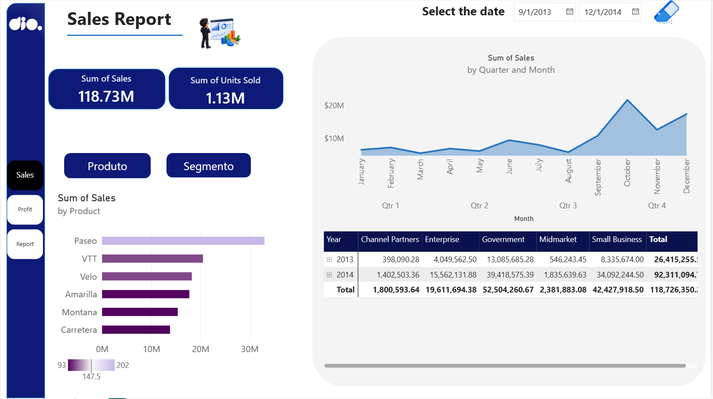
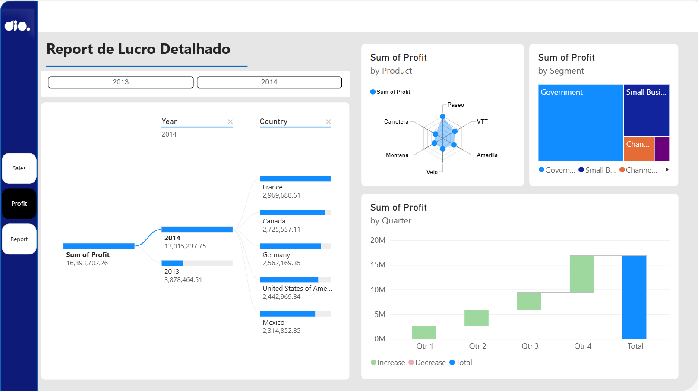
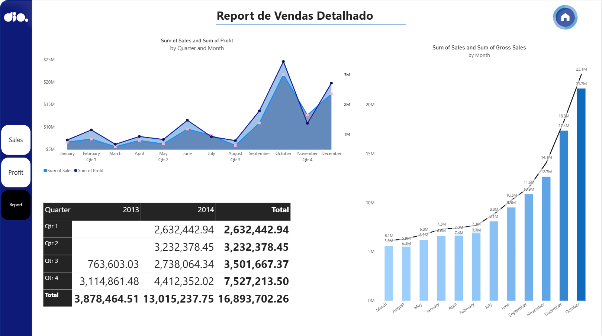

# 📊 Relatório de Vendas — Redesign com Foco em UX

### Visão Geral
Este projeto é um redesign de um relatório financeiro/de vendas anterior no Power BI, com foco em **experiência do usuário (UX)**. O objetivo foi pegar um "relatório criativo" já existente e aprimorá-lo aplicando princípios centrais de UX: **posicionamento, contraste, proporção áurea e segmentação dos dados** — sem deixar de lado escolhas criativas que quebrem as "regras" quando fizer sentido.

O relatório final tem **3 páginas**, conectadas por botões de navegação:

1. **Sales** — KPIs gerais e desempenho por produto
2. **Profit** — detalhamento e exploração do lucro
3. **Report** — análise detalhada de tendências e comparações

### Páginas

#### 1. Sales

- Cards de KPI: Soma de Vendas (118.73M) e Soma de Unidades Vendidas (1.13M)
- Gráfico de barras: Soma de Vendas por Produto
- Gráfico de área: Soma de Vendas por Trimestre e Mês
- Matriz: Soma de Vendas por Ano e Canal (Channel Partners, Enterprise, Government, Midmarket, Small Business)
- Botões de navegação para as visões Produto / Segmento

#### 2. Profit

- Decomposition Tree: Soma de Lucro por Ano e País
- Gráfico radar: Soma de Lucro por Produto
- Treemap: Soma de Lucro por Segmento
- Gráfico cascata (waterfall): Soma de Lucro por Trimestre (Aumento / Redução / Total)

#### 3. Report

- Gráfico combinado: Soma de Vendas e Soma de Lucro por Trimestre e Mês
- Gráfico de linha: Soma de Vendas e Soma de Vendas Brutas por Mês (com rótulos de dados)
- Matriz: Totais por Trimestre e Ano
- Botão de navegação para a página inicial

### Princípios de UX aplicados
- **Posicionamento** — métricas-chave (KPIs) no canto superior esquerdo, seguindo o fluxo natural de leitura
- **Contraste** — barra lateral azul-marinho escura vs. área de conteúdo clara, separando navegação de dados
- **Proporção áurea** — usada como referência para dimensionar/posicionar os blocos visuais
- **Segmentação** — filtros e detalhamentos (Produto, Segmento, País, Ano) para o usuário explorar o que for relevante

### Ferramentas
- Power BI Desktop
- Fonte de dados: dataset Financials (programa Santander/DIO "Formação Power BI Analyst")

### Autor
Angelo — [github.com/angelommorozini](https://github.com/angelommorozini)
